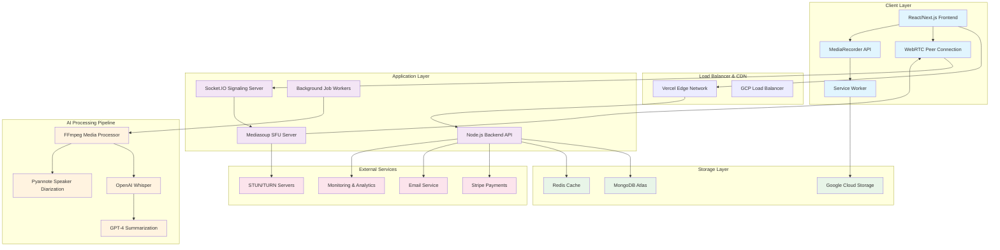

# PodSync Complete Implementation Guide
*From Concept to Production: Building a 10-Person AI-Powered Podcast Platform*

## 🏗️ System Architecture Overview



## 📚 Learning Path & Documentation Requirements

### Phase 1: Core Technologies Mastery

#### WebRTC & Real-Time Communication
**Essential Documentation:**
- MDN WebRTC API Documentation
- RTCPeerConnection Specification (W3C)
- "WebRTC for the Curious" by Sean DuBois
- Mediasoup Documentation & Examples
- Socket.IO Real-time Communication Guide

**Key Concepts to Master:**
- ICE Candidates & NAT Traversal
- SDP (Session Description Protocol)
- STUN/TURN Server Configuration
- Simulcast & Adaptive Bitrate
- Media Transport Security (DTLS/SRTP)

#### TypeScript Advanced Patterns
**Essential Documentation:**
- TypeScript Handbook (Advanced Types)
- Effective TypeScript by Dan Vanderkam
- TypeScript Deep Dive by Basarat Ali Syed

**Focus Areas:**
- Generic Constraints & Mapped Types
- Utility Types & Conditional Types
- Declaration Merging
- Module Augmentation
- Strict Type Checking

#### AI/ML Integration
**Essential Documentation:**
- OpenAI Whisper GitHub Repository
- Pyannote-audio Documentation
- HuggingFace Transformers Library
- FFmpeg Documentation & Filters

**Learning Path:**
- Audio Processing Fundamentals
- Speech Recognition Models
- Speaker Diarization Techniques
- Large Language Model Integration

### Phase 2: Infrastructure & DevOps

#### Container Orchestration
**Essential Documentation:**
- Docker Official Documentation
- Google Cloud Run Documentation
- Kubernetes Concepts (for scaling)

#### CI/CD & Deployment
**Essential Documentation:**
- GitHub Actions Documentation
- Google Cloud Build
- Vercel Deployment Guide

## 🎯 Implementation Strategy

### Frontend Development Approach

#### Step 1: Architecture Setup
**Project Structure:**
```
frontend/
├── src/
│   ├── components/          # Reusable UI components
│   │   ├── common/          # Generic components
│   │   ├── media/           # Video/Audio components
│   │   └── session/         # Session-specific components
│   ├── hooks/               # Custom React hooks
│   │   ├── useWebRTC.ts     # WebRTC connection management
│   │   ├── useMediaRecorder.ts # Local recording
│   │   └── useSocket.ts     # Socket.IO integration
│   ├── stores/              # State management
│   │   ├── sessionStore.ts  # Session state
│   │   ├── participantStore.ts # Participant management
│   │   └── recordingStore.ts # Recording state
│   ├── services/            # API & external services
│   │   ├── api.ts           # REST API client
│   │   ├── webrtc.ts        # WebRTC utilities
│   │   └── upload.ts        # File upload service
│   ├── types/               # TypeScript definitions
│   │   ├── webrtc.types.ts  # WebRTC interfaces
│   │   ├── session.types.ts # Session interfaces
│   │   └── api.types.ts     # API interfaces
│   └── utils/               # Utility functions
```

**Key Dependencies to Study:**
- Next.js 14 App Router
- Zustand for State Management
- Socket.IO Client
- TUS Protocol for Resumable Uploads
- Tailwind CSS + Headless UI

#### Step 2: WebRTC Implementation Strategy
**Learning Sequence:**
1. **Basic Peer Connection:** Start with 1-to-1 connection
2. **Media Stream Handling:** getUserMedia() and getDisplayMedia()
3. **Signaling Protocol:** Custom signaling over Socket.IO
4. **SFU Integration:** Connect to Mediasoup server
5. **Quality Adaptation:** Implement simulcast layers

**Critical Implementation Points:**
- Implement connection state management
- Handle network reconnection gracefully
- Manage media device permissions
- Implement bandwidth adaptation

#### Step 3: Recording & Upload System
**Technical Approach:**
- Use MediaRecorder API with high-quality settings
- Implement chunked recording for memory management
- Service Worker for background upload processing
- IndexedDB for crash recovery

### Backend Development Approach

#### Step 1: Core Server Architecture
**Project Structure:**
```
backend/
├── src/
│   ├── controllers/         # Request handlers
│   │   ├── auth.controller.ts
│   │   ├── session.controller.ts
│   │   └── upload.controller.ts
│   ├── middleware/          # Express middleware
│   │   ├── auth.middleware.ts
│   │   ├── validation.middleware.ts
│   │   └── error.middleware.ts
│   ├── models/              # Database schemas
│   │   ├── User.model.ts
│   │   ├── Session.model.ts
│   │   └── Recording.model.ts
│   ├── services/            # Business logic
│   │   ├── webrtc.service.ts
│   │   ├── upload.service.ts
│   │   └── ai.service.ts
│   ├── sockets/             # Socket.IO handlers
│   │   ├── signaling.handler.ts
│   │   └── session.handler.ts
│   ├── workers/             # Background jobs
│   │   ├── media.processor.ts
│   │   └── ai.processor.ts
│   └── types/               # TypeScript definitions
```

**Key Technologies to Master:**
- Express.js with TypeScript
- Socket.IO for WebSocket handling
- Mongoose with TypeScript
- Bull.js for job queues
- JWT authentication

#### Step 2: Signaling Server Implementation
**Learning Requirements:**
- WebRTC Signaling Protocol Design
- Socket.IO Room Management
- Connection State Synchronization
- Error Handling & Reconnection

**Implementation Focus:**
- Room-based participant management
- SDP offer/answer exchange
- ICE candidate relay
- Connection quality monitoring

#### Step 3: Upload & Processing Pipeline
**Technical Components:**
- TUS Protocol implementation
- Chunked upload handling
- File integrity verification
- Background job processing

### SFU Server Development Approach

#### Step 1: Mediasoup Setup & Configuration
**Learning Path:**
- Mediasoup Architecture Understanding
- Worker and Router Management
- Transport and Producer/Consumer Lifecycle
- RTP Parameter Configuration

**Project Structure:**
```
sfu-server/
├── src/
│   ├── server.ts            # Main server entry
│   ├── mediasoup/           # Mediasoup configuration
│   │   ├── worker.ts        # Worker management
│   │   ├── router.ts        # Router configuration
│   │   └── transport.ts     # Transport handling
│   ├── handlers/            # Socket handlers
│   │   ├── connection.handler.ts
│   │   └── media.handler.ts
│   ├── services/            # SFU services
│   │   ├── session.service.ts
│   │   └── participant.service.ts
│   └── types/               # TypeScript definitions
```

#### Step 2: Scalability Considerations
**Architecture Decisions:**
- Multi-worker configuration for CPU utilization
- Router scaling strategies
- Bandwidth management algorithms
- Quality layer selection logic

### AI Processing Pipeline Approach

#### Step 1: Media Processing Setup
**Required Knowledge:**
- FFmpeg command-line usage
- Audio/Video codec understanding
- Container format specifications
- Stream synchronization techniques

**Implementation Strategy:**
- Containerized FFmpeg processing
- Queue-based job processing
- Progress tracking and reporting
- Error handling and retry logic

#### Step 2: AI Model Integration
**Learning Requirements:**
- OpenAI Whisper API usage
- Pyannote-audio Python integration
- Large Language Model APIs
- Audio preprocessing techniques

**Technical Implementation:**
- Python worker services
- Model optimization for production
- Batch processing strategies
- Result caching and storage

## 🐳 Docker & Containerization Strategy

### Multi-Container Architecture
**Container Strategy:**
```
docker/
├── frontend.Dockerfile      # Next.js production build
├── backend.Dockerfile       # Node.js API server
├── sfu.Dockerfile          # Mediasoup SFU server
├── ai-worker.Dockerfile    # Python AI processing
└── docker-compose.yml      # Development environment
```

**Learning Requirements:**
- Multi-stage Docker builds
- Container networking
- Volume management
- Environment variable handling
- Health check implementation

## 🚀 CI/CD & Deployment Approach

### GitHub Actions Workflow Strategy
**Workflow Structure:**
```
.github/
└── workflows/
    ├── frontend-deploy.yml  # Vercel deployment
    ├── backend-deploy.yml   # GCP Cloud Run
    ├── sfu-deploy.yml      # SFU server deployment
    ├── ai-worker-deploy.yml # AI worker deployment
    └── integration-test.yml # E2E testing
```

**Implementation Focus:**
- Automated testing pipelines
- Security scanning
- Performance benchmarking
- Rollback strategies

## 📖 Essential Documentation to Create

### Technical Documentation
1. **API Documentation** - OpenAPI/Swagger specs
2. **WebRTC Protocol Guide** - Custom signaling documentation  
3. **Deployment Guide** - Step-by-step deployment instructions
4. **Architecture Decision Records (ADRs)** - Design decision documentation
5. **Performance Benchmarks** - Load testing results and optimizations

### User Documentation
1. **User Guide** - How to use the platform
2. **Admin Guide** - Platform administration
3. **API Reference** - For third-party integrations
4. **Troubleshooting Guide** - Common issues and solutions

## 🎓 Learning Resources by Topic

### WebRTC Deep Dive
- **Books:** "WebRTC for the Curious" by Sean DuBois
- **Courses:** WebRTC Course by Google (web.dev)
- **Documentation:** MDN WebRTC API Reference
- **Practice:** Simple peer-to-peer examples before SFU

### TypeScript Mastery
- **Books:** "Effective TypeScript" by Dan Vanderkam
- **Documentation:** TypeScript Handbook
- **Practice:** Build type-safe API clients and server handlers

### Real-Time Systems
- **Books:** "Designing Data-Intensive Applications" by Martin Kleppmann
- **Documentation:** Socket.IO Documentation
- **Practice:** Build chat applications with presence awareness

### AI/ML Integration
- **Courses:** Hugging Face NLP Course
- **Documentation:** OpenAI API Documentation
- **Practice:** Build speech-to-text applications

### Infrastructure & DevOps
- **Books:** "Docker Deep Dive" by Nigel Poulton
- **Documentation:** Google Cloud Documentation
- **Practice:** Deploy scalable containerized applications

## 🔧 Development Environment Setup

### Required Tools & Versions
- Node.js 18+ with npm/yarn
- Docker Desktop
- Google Cloud SDK
- FFmpeg (local development)
- Python 3.9+ (for AI components)

### Development Workflow
1. **Local Development:** Docker Compose for all services
2. **Testing:** Jest for unit tests, Playwright for E2E
3. **Code Quality:** ESLint, Prettier, TypeScript strict mode
4. **Git Workflow:** Feature branches with PR reviews

## 🎯 Success Metrics & Validation

### Technical Metrics
- **Latency:** < 150ms for WebRTC connections
- **Reliability:** 99.9% uptime for recording sessions
- **Scalability:** Support 10 concurrent participants
- **Quality:** Studio-quality audio/video output

### Business Metrics
- **User Experience:** < 5 second session join time
- **Conversion:** Freemium to paid conversion tracking
- **Performance:** AI processing < 2x recording duration

This comprehensive guide provides the foundation for building PodSync from scratch to production. Each phase builds upon the previous, ensuring a solid understanding of the underlying technologies while maintaining focus on production-ready implementation.